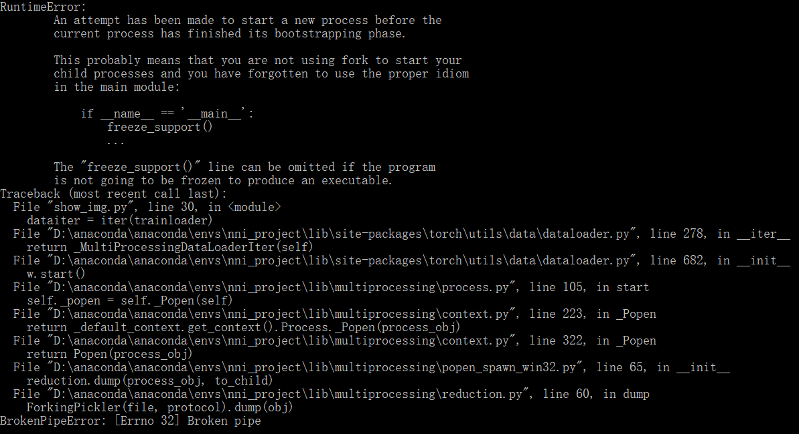

# NNI进阶项目Training a classifier文档

[^Team18]: 吸喵小分队

深度学习框架PyTorch由Facebook开发。与另一常用深度学习框架Tensorflow主要的差异在于后者以静态方式生成计算图，前者框架更贴近Python语言，执行动态图。

本实验所使用的数据集为PyTorch中自带的CIFAR10数据集，参考样例来自PyTorch官网：https://pytorch.org/tutorials/beginner/blitz/cifar10_tutorial.html。

### 一、运行环境

系统：windows10

环境：Anaconda / Visual Studio Code

​			PyTorch

导入包：运用pip工具安装numpy，torch，torchvision三个关键包。

```python
import matplotlib.pyplot as plt
import numpy as np
import torch
import torchvision
import torchvision.transforms as transforms
import torch.nn as nn
import torch.nn.functional as F
import torch.optim as optim
```

### 二、文件说明

针对于预期实现的功能，我们针对于每一步骤的需求使用了四个python文件：download.py，show_image.py，train.py和predict.py；后一个文件均建立在前一个文件完成运行的基础上。

其中关键运行文件为show_image.py，train.py和predict.py（download.py功能能在show_image.py中直接实现）。

### 三、运行结果

在Anaconda Prompt中直接运行python文件：

##### 呈现图像

输入的命令行语句：

```
python show_img.py
```

能得到输出：

```
Files already downloaded and verified
plane truck cat plane    ##result of your picture, depending on specific img
```

并且能看见一张展示出的Figure文件。

##### 进行训练

输入的命令行语句：

```
python train.py
```

能得到输出：

```
Files already downloaded and verified
[1,  2000] loss: 2.219    ##result of your training, depending on situations
[1,  4000] loss: 1.877
[1,  6000] loss: 1.700
[1,  8000] loss: 1.568
[1, 10000] loss: 1.524
[1, 12000] loss: 1.483
[2,  2000] loss: 1.415
[2,  4000] loss: 1.382
[2,  6000] loss: 1.346
[2,  8000] loss: 1.327
[2, 10000] loss: 1.289
[2, 12000] loss: 1.300
```

并且在默认路径能够发现生成了cifar_net.pth的路径文件。

可以观察到虽然损失偏高，但仍然能够发现损失率随着运算次数的增多而逐渐降低。

##### 得到预测

输入的命令行语句：

```
python predict.py
```

能得到输出：

```
Files already downloaded and verified
Accuracy of plane : 52 %   ##result of your training, depending on situations
Accuracy of   car : 56 %
Accuracy of  bird : 40 %
Accuracy of   cat : 46 %
Accuracy of  deer : 43 %
Accuracy of   dog : 42 %
Accuracy of  frog : 76 %
Accuracy of horse : 55 %
Accuracy of  ship : 79 %
Accuracy of truck : 61 %
```

修改predict.py文件中的运算方式和输出语句，我们还可以得到不同的预测结果。示例代码中输出结果为对于某一特定类别识别的预测准确度，还可以实现对一组图片做类似image_show.py中的图片内容识别，或对某大定量的图片进行预测判断得到该范围内的预测准确度。

### 四、问题与解决方案

我们运行代码时遇到的问题为：

##### 1、BrokenPipeError: [Errno 32] Broken pipe



解决方法：setting the num_workr of torch.utils.data.DataLoader() to 0